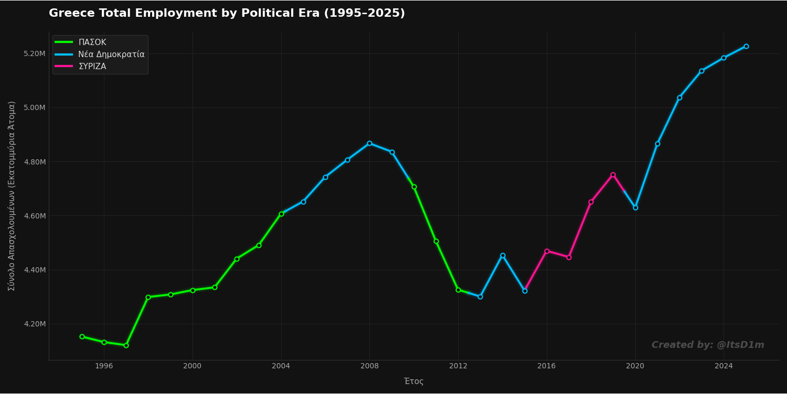

# greek-employment-rate
Data visualization of Greece's total employment figures (1995-2025) correlated with political eras using Python, Pandas, and Matplotlib.

# 📊 Greek Employment History & Political Eras (1995-2025)

A professional data visualization project built with Python, tracking the total employment figures in Greece over a 30-year period and correlating the data with the ruling political parties.

## 🎯 Overview
This script processes historical employment data and creates a high-quality, dark-themed chart. It highlights the massive job losses during the Greek financial crisis and the subsequent recovery, color-coded by the political administration in power at the time.



## 🛠️ Technical Stack
* **Language:** Python 3.11
* **Data Processing:** `pandas`, `numpy` (Linear Interpolation for dense curve generation)
* **Visualization:** `matplotlib` (Custom dark theme, neon glow effects, dynamic legends)

## 💡 Key Features
* **Custom Data Engineering:** Parses raw data and maps historical dates to the corresponding Greek governments.
* **Algorithmic Smoothing:** Utilizes `numpy.interp` to generate 3000 artificial data points, ensuring a flawless visual transition and glow effect at the exact boundaries of political shifts.
* **Pro UI/UX:** Styled as a modern financial dashboard (dark background, glowing lines, custom gridless axes).

## 🚀 How to Run
1. Clone the repository.
2. Ensure you have `pandas`, `numpy`, and `matplotlib` installed.
3. Run the script:
   ```bash
   python anergia.py
